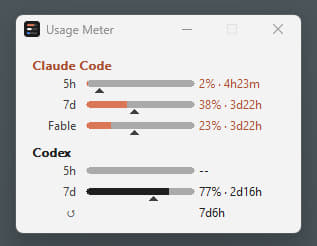

# Usage Meter

A tiny native Windows app that shows how much of your AI agent rate limits is
used up, for three providers at once:

| Provider | What it shows |
|---|---|
| **Claude Code** (Anthropic) | 5-hour window, 7-day window, and per-model weekly limits (e.g. Fable) when the account has them |
| **Codex** (OpenAI/ChatGPT) | both rate-limit windows plus granted rate-limit reset credits |
| **Antigravity** (Google) | 5-hour and weekly Gemini quota |

Each value is rendered as a slim rounded fill bar with a text like
`42% · 2h11m` — the consumed share and a live countdown to the window reset.
A small pointer under the bar marks how much of the window has already elapsed
(with one hour left of a five-hour window it sits at 80%), so you can see at a
glance whether you are burning the limit faster than the clock runs it down.



## Key properties

- **No backend of its own.** The app reads local credentials already saved by
  the providers' CLI tools and talks to their endpoints directly.
- **Never writes credentials.** Refreshing an expired token is delegated to
  the corresponding CLI (`claude` / `codex`), started as a hidden child
  process.
- **No telemetry, no auto-update**, no network activity beyond polling usage.
- The only persistent file is the window settings.

## Features

- Slim pill-style fill bars, light/dark theme following the system, colored
  per provider.
- Live countdowns that tick without extra network requests; expired Codex
  reset credits disappear on their own.
- Providers are toggled from the menu; the window resizes to fit.
- Auth errors pause polling and watch the credential stores (file, WSL,
  Credential Manager); polling resumes automatically after you sign in again.
- Transient network errors retry with exponential backoff.
- A provider that could not be refreshed keeps its last known numbers, drawn
  faded so it is clear they are no longer current.
- A rate-limited Claude usage endpoint (HTTP 429) is left alone for a growing
  cooldown instead of being polled on every round.
- Per-Monitor V2 DPI awareness, position persistence, single-instance guard.
- Proxy support (`HTTPS_PROXY`/`ALL_PROXY`/`NO_PROXY`) with a CONNECT tunnel:
  TLS stays end-to-end, the proxy never sees bearer tokens.

## Credentials it reads

| Provider | Source |
|---|---|
| Claude Code | `%USERPROFILE%\.claude\.credentials.json`, falling back to WSL distributions (`~/.claude/.credentials.json`) |
| Codex | `%CODEX_HOME%\auth.json` or `%USERPROFILE%\.codex\auth.json` |
| Antigravity | Windows Credential Manager, generic credential `gemini:antigravity` |

## Download

Prebuilt Windows binaries are on the
[releases page](https://github.com/vladimirgamalyan/usage-meter/releases):
grab `usage-meter-<version>-x86_64-windows.exe` and run it — there is nothing to
install. The executable is unsigned, so SmartScreen warns about it on the first
run.

## Build

Requires Rust (edition 2021) on Windows with the MSVC toolchain.

```
cargo build --release
```

The binary is `target\release\usage-meter.exe` (~450 KB). TLS uses the system
SChannel via `native-tls`; no root certificates are bundled.

## Usage

Run `usage-meter.exe`. The **Settings** menu sits in the window menu — click
the title-bar icon, right-click the caption or press Alt+Space — and is also
available as a right-click context menu over the window itself. It provides:

- **Refresh** — poll immediately.
- **Update Frequency** — 5 minutes to 1 hour (default 15 minutes).
- **Reset Credit Frequency** — how often the Codex reset-credit list is
  re-fetched (default 6 hours); shown only when Codex is enabled.
- **Models** — which providers to show (at least one is always enabled).
- **Show Percentage** — on by default; turning it off leaves only the reset
  countdown next to each fill bar, so usage is read from the bars alone.

Settings are stored in `%APPDATA%\UsageMeter\settings.json`.

### Diagnostics

Start with `--diagnose` to write a log to `%TEMP%\usage-meter.log`
(recreated on every start). Without the flag logging is fully disabled.

## Acknowledgements

Inspired by [Claude-Code-Usage-Monitor](https://github.com/CodeZeno/Claude-Code-Usage-Monitor)
by CodeZeno. Usage Meter is an independent implementation written from
scratch, not a fork, and shares no code with the original.

## License

[MIT](LICENSE)
